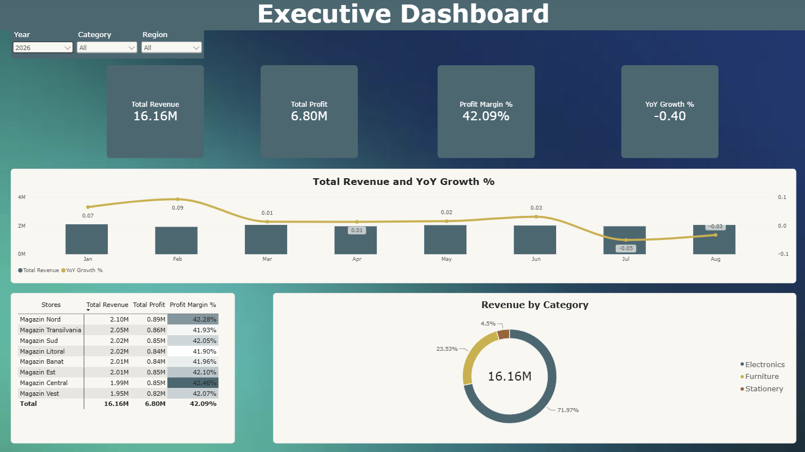

# 📊 Retail Sales Performance & Profitability Analytics Dashboard

## 📌 Project Overview
This project presents an end-to-end data analytics solution built for a multi-store retail business. Analyzing a dataset of over 120,000 transaction records (2023–2026), the project consolidates historical sales data to evaluate overall financial health, identify core revenue drivers, and track Year-over-Year (YoY) performance across regional store locations.

---

## 🎯 Business Requirements & Impact

| Business Requirement | Technical Solution | Business Impact & Owner |
| :--- | :--- | :--- |
| **Centralize Regional Data:** Combine multi-year sales transactions across all store locations into a unified reporting model. | Modeled a relational database in **PostgreSQL** and built a clean **Star Schema** in Power BI. | Provides a single source of truth across all regional stores. |
| **Track Financial Performance:** Monitor overall revenue, profit, margins, and growth trajectories. | Created custom **DAX measures** (`Total Revenue`, `Total Profit`, `Profit Margin %`, `YoY Growth %`). | **Execs / Finance:** Delivers real-time visibility into net profitability (**42.06%** margin) and annual growth (**19.74%**). |
| **Identify Core Revenue Drivers:** Pinpoint top-performing product categories and high-growth stores. | Designed interactive visuals with cross-filtering (Dual-axis trend chart & Donut Chart). | **Sales / Marketing:** Highlighted **Electronics** as the primary growth engine (**72.16%** of total revenue). |

---

## 🛠️ Step-by-Step Implementation

### Step 1: Data Extraction & Transformation (PostgreSQL)
* Cleaned and processed multi-year transaction tables (`sales`, `products`, `stores`).
* Wrote optimized SQL queries using `JOIN`s, `GROUP BY` aggregations, CTEs, and Window Functions (`DENSE_RANK()`, `LAG()`) to aggregate revenue trends prior to Power BI ingestion.

### Step 2: Data Modeling (Power BI)
* Implemented a **Star Schema** architecture linking the central `sales` fact table to dimension tables (`stores`, `products`).
* Built a custom DAX `Calendar` dimension table to enable accurate Time Intelligence comparisons (`SAMEPERIODLASTYEAR`).

### Step 3: Key Financial Metrics (DAX Calculations)
* **Total Revenue:** **$98.01M** — Evaluates cumulative transaction value across the entire period.
* **Total Profit:** **$41.22M** — Tracks net bottom-line earnings.
* **Profit Margin %:** **42.06%** — Real-time margin efficiency (`Total Profit / Total Revenue`).
* **YoY Growth %:** **19.74%** — Year-over-year revenue growth trajectory.

### Step 4: Executive Dashboard Design
* Designed a single-page executive interface with high-contrast KPI cards, a dual-axis Line & Clustered Column chart (Monthly Revenue + YoY Growth %), category share distribution, and a detailed store-level matrix.

---

## 💡 Key Business Insights

1. **Category Heavyweight:** **Electronics** accounts for **72.16%** of total revenue, proving to be the primary business engine. Marketing and promotional efforts should continue prioritizing tech campaigns.
2. **Strong Profitability:** The business maintains a healthy **42.06% Profit Margin** and an impressive **19.74% YoY Growth rate**, reflecting solid operational efficiency across all regions.
3. **Balanced Regional Distribution:** Sales are evenly distributed across all 8 regional stores (averaging **~$12.06M to $12.36M** per location), showing consistent nationwide market penetration.

---

## 🎯 Strategic Recommendations

| Action / Recommendation | Target Team (Owner) | Expected Business Impact | Metric to Track (KPI) |
| :--- | :--- | :--- | :--- |
| **Cross-Selling Strategies:** Bundle high-margin items (*Stationery / Furniture*) with core *Electronics* products. | **Marketing & Retail Sales** | Increases average transaction size while boosting secondary category sales (**4.46%** share). | *Average Order Value (AOV)* |
| **Regional Campaign Alignment:** Target promotional funds toward top-performing regions like *Magazin Nord* ($12.36M) during seasonal peaks. | **Regional Operations** | Capitalizes on high-converting regional customer bases during key sales cycles. | *YoY Growth % per Region* |

---

## 📁 Repository Structure
* `schema_and_queries.sql` – PostgreSQL scripts (table definitions, joins, CTEs, and window functions).
* `Retail_Analytics_Dashboard.pbix` – Interactive Power BI Desktop report file.
* `dashboard_preview.png` – High-resolution preview image of the Executive Dashboard.
